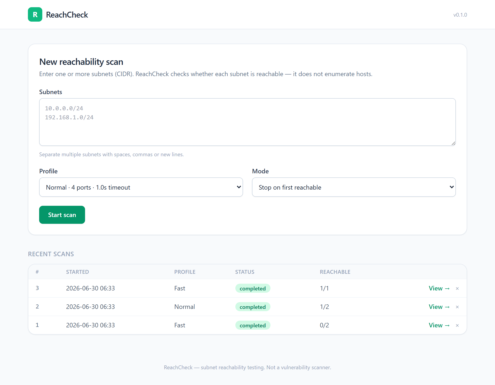
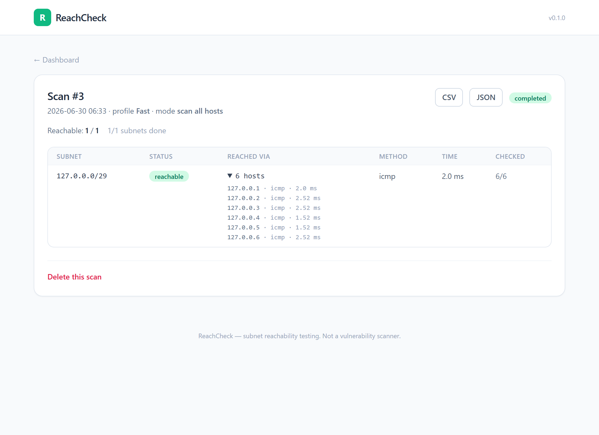

# ReachCheck

A VLAN/subnet **reachability testing tool**. Its purpose is to quickly determine
**whether one or more CIDRs (subnets) are reachable** — not to enumerate hosts.

> This is not a vulnerability scanner. It only checks network reachability.

<p align="center">
  
</p>

<p align="center">
  <em>Scan detail — in "scan all hosts" mode every reached machine is listed:</em><br>
  
</p>

## Features

- One or multiple CIDR inputs (whitespace/comma/semicolon separated)
- Scan profiles: **Fast / Normal / Slow** (concurrency, timeout, retries, ports)
- Scan modes: **stop on first reachable** (default) / **scan all hosts**
- Hybrid probe: ICMP first, TCP fallback — works without privileges
- Subnet-centric results: each subnet is reachable or not (not a host inventory)
- Live progress via Server-Sent Events
- Dashboard: new scan + scan history with delete
- Re-scan the unreachable ones (same or escalated profile), with parent/child chain
- Export results as CSV or JSON

## Tech stack

FastAPI · asyncio · SQLite/SQLAlchemy · HTMX + Jinja2 + Tailwind · icmplib

## Why not ICMP only?

ICMP needs raw-socket privileges and is often firewalled. A host can be
unreachable by ping yet still reachable on an open service port. ReachCheck pings
first when it can, and falls back to a TCP connect to a few common ports — a
refused connection (RST) still proves the host is up.

## Security & responsible use

- **Only scan networks you own or are explicitly authorized to test.** Unauthorized
  scanning may be illegal and against acceptable-use policies.
- **No authentication.** ReachCheck is a single-user local tool. It binds to
  `127.0.0.1` by default — keep it that way. Do not expose it to untrusted networks
  or the public internet without putting your own authentication/proxy in front.
- **ICMP needs privileges.** Pinging uses raw sockets (administrator on Windows,
  root/`CAP_NET_RAW` on Linux). Without them ReachCheck silently falls back to TCP.
- The bundled SQLite database (`reachcheck.db`) and `.env` are git-ignored so scan
  history and local settings are never committed.

## Requirements

Python 3.10+. ICMP probing needs raw-socket privileges (administrator on Windows,
root/`CAP_NET_RAW` on Linux); without them ReachCheck falls back to TCP.

## Setup

```bash
python -m venv .venv
.venv\Scripts\activate        # Windows
pip install -e ".[dev]"
copy .env.example .env        # Windows
```

## Run

```bash
python -m app.main
# or
uvicorn app.main:app --reload
```

Then open: http://127.0.0.1:8000

## CLI (manual testing, no web server)

```bash
python -m app.cli 10.0.0.0/24 192.168.1.0/24 --profile normal --mode early
python -m app.cli 127.0.0.0/30 --ports 80 443 --timeout 0.5 --verbose
```

## Tests

```bash
pytest          # full suite
ruff check .    # lint
```

## API

| Method | Path | Description |
|--------|------|-------------|
| POST   | `/api/scans` | start a scan |
| GET    | `/api/scans` | list recent scans |
| GET    | `/api/scans/{id}` | scan detail with results |
| GET    | `/api/scans/{id}/stream` | live progress (SSE) |
| GET    | `/api/scans/{id}/export?format=csv\|json` | download results |
| POST   | `/api/scans/{id}/cancel` | cancel a running scan |
| DELETE | `/api/scans/{id}` | delete a scan |

## Project structure

```
app/
  main.py            # FastAPI entry point
  config.py          # settings (env-based)
  api/               # HTTP routes
  web/templates/     # Jinja2 + HTMX templates
  core/              # scan core (probes, scanner, profiles, cidr)
  services/          # business logic (scan, history)
  models/            # SQLAlchemy models + Pydantic schemas
  db/                # database connection
  tasks/             # background scan manager
```

## License

Released under the [MIT License](LICENSE).
